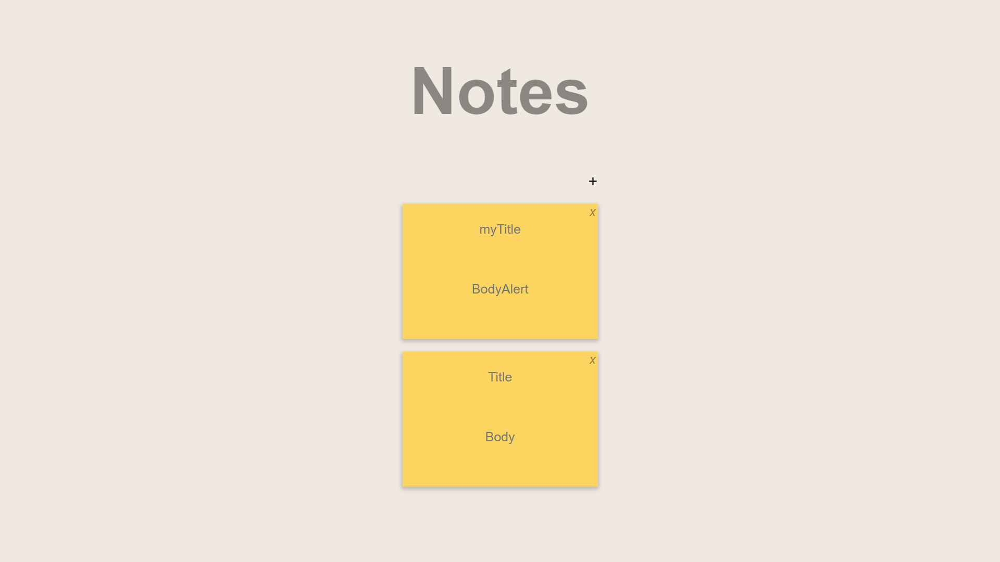

# notes-app
Re-affirming previously learned things creating a notes app with vanillaJS and node REST API


## Installation & Usage

clone repo

cd into notes-app/backend
and do the following commands

```bash
$ npm install
$ node bin/www
```
then cd out of backend dir and cd into frontend/public and open html file in your browser
## Built With

* [ES6]
* [HTML5]
* [CSS3]


## Authors
 Carlos Francisco Franco Roque

## Contributing
Pull requests are welcome. For major changes, please open an issue first to discuss what you would like to change.


## Acknowledgments
 All the developers.

## License
[MIT](https://choosealicense.com/licenses/mit/)
